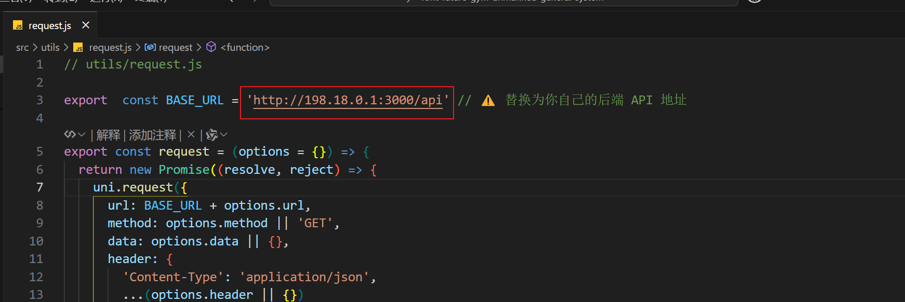

# 项目启动文档

## 项目概述

“燃时自助健身房系统”是一款提供自助服务的健身房管理系统，分为前端客户端、小程序接口和后台管理系统。前端部分使用 **uniapp** 开发，后端接口使用 **Node.js** 提供，后台管理系统使用 **Spring Boot**。

## 项目仓库

- **客户端前端小程序代码仓库地址**：[https://gitee.com/luo_lo/future-gym-unmanned-general-system.git](https://gitee.com/luo_lo/future-gym-unmanned-general-system.git)
- **客户端后端接口代码仓库地址**：[https://gitee.com/luo_lo/gym_back.git](https://gitee.com/luo_lo/gym_back.git)
- **后台代码仓库地址（前后端不分离）**：[https://gitee.com/luo_lo/gym_background.git](https://gitee.com/luo_lo/gym_background.git)

## 项目启动步骤

### 1. 安装与配置

#### 1.1 环境配置

##### 前端（客户端小程序）

1. **安装 HBuilderX**：用于开发和调试 **uniapp** 小程序。
   - 官方下载链接：[HBuilderX下载](https://www.dcloud.io/hbuilderx.html)
2. **微信开发者工具**：用于调试和发布 **微信小程序**。
   - 官方下载链接：[微信开发者工具](https://developers.weixin.qq.com/miniprogram/dev/devtools/download.html)

##### 后端接口（Node.js）

1. **安装 Node.js**：确保安装 Node.js（版本 14.x 或更高）和 npm（Node 包管理器）。

   - 官方下载链接：[Node.js 下载](https://nodejs.org/)
2. **安装依赖**：

   1. 克隆 **客户端后端接口代码仓库**：
      ```bash
      git clone https://gitee.com/luo_lo/gym_back.git
      ```
   2. 进入项目目录并安装依赖：
      ```bash
      cd gym_back
      npm install
      ```
3. **配置数据库**：

   - 本系统使用 **MySQL** 作为数据库，确保安装并运行 **MySQL 8.0** 或更高版本。
   - 配置数据库连接信息在项目的 **config** 文件中，确保与本地数据库一致。
4. **启动后端服务**：

   ```bash
   npm run dev
   ```

   后端服务将启动在 `http://localhost:3000`，API 接口供客户端使用。

##### 后台（Spring Boot）

1. **安装 JDK**：确保本地已安装 **JDK 8** 或更高版本。

   - 官方下载链接：[JDK下载](https://www.oracle.com/java/technologies/javase-downloads.html)
2. **安装 Maven**：本项目使用 **Maven** 进行依赖管理和构建。

   - 官方下载链接：[Maven下载](https://maven.apache.org/download.cgi)
3. **克隆后台代码仓库**：

   ```bash
   git clone https://gitee.com/luo_lo/gym_background.git
   ```
4. **配置数据库连接**：

   - 配置 **application.properties** 文件中的数据库连接信息，确保连接到本地 **MySQL** 数据库。
5. **构建并启动后台服务**：

   - 使用 **Maven** 构建项目：
     ```bash
     mvn clean install
     ```
   - 启动后台服务：
     ```bash
     mvn spring-boot:run
     ```

   后台服务将默认启动在 `http://localhost:8080`。

### 2. 启动流程

1. **启动数据库**：

   - 确保本地 **MySQL** 数据库服务已启动，并使用 `nopeople_gym` 数据库。
   - 执行数据库脚本初始化数据库表，数据库表在 `gym_back/models/`。
2. **启动后端接口服务（Node.js）**：

   - 打开终端，进入到 **gym_back** 目录，执行：
     ```bash
     npm run dev
     ```
   - 该服务将监听 `http://localhost:3000`。
3. **启动后台管理服务（Spring Boot）**：

   - 在后台管理项目目录中，执行：
     ```bash
     mvn spring-boot:run
     ```
   - 该服务将监听 `http://localhost:8080`。
4. **启动前端小程序（uniapp）**：

   - 在 `font-future-gym-unmanned-general-system\src\utils\request.js` 文件里面配置后端本地ip

     
   - 打开 **HBuilderX**，在 **uniapp** 项目的根目录中执行。
   - 点击 **运行**，选择 **微信小程序** 进行预览，确保能够连接到本地后端接口和数据库。

### 3. 配置说明

1. **数据库**：

   - 数据库使用 **MySQL 8.0** 或更高版本，数据库名为 `nopeople_gym`。
   - 配置文件：`src/config/dbConfig.js`（Node.js 后端） 和 `src/main/resources/application.properties`（Spring Boot 后台）。
2. **API 接口**：

   - 前端小程序通过 **Node.js** 提供的 RESTful API 接口与后端交互。
   - 后台管理通过 **Spring Boot** 提供的后台管理系统进行用户和设备管理。
3. **支付接口**：

   - 支持 **微信支付** 和 **支付宝支付**，需要配置各自的 API 密钥。
   - 配置文件：`src/config/paymentConfig.js`（Node.js 后端） 和 `src/main/resources/application.properties`（Spring Boot 后台）。

### 4. 测试与调试

- **前端测试**：使用 **微信开发者工具** 或 **HBuilderX** 进行小程序调试。
- **后端测试**：使用 Postman 或 cURL 进行接口测试，确保后端接口能正常处理请求。
- **功能测试**：完成基本功能测试，检查登录、会员卡购买、扫码开门等主要功能是否正常。

### 5. 项目部署（生产环境）

1. **服务器配置**：

   - 生产环境可以部署到云服务器（如阿里云、AWS）上，配置负载均衡和数据库备份。
   - 使用 **Nginx** 或 **Apache** 作为反向代理服务器。
2. **自动化部署**：

   - 使用 **Docker** 容器化部署，打包成容器镜像，简化生产环境的部署和运维。

---

此文档为 **“燃时自助健身房系统”** 的启动文档，包含了从开发到生产的所有步骤。如果你有其他问题或需要进一步的帮助，请告诉我！
